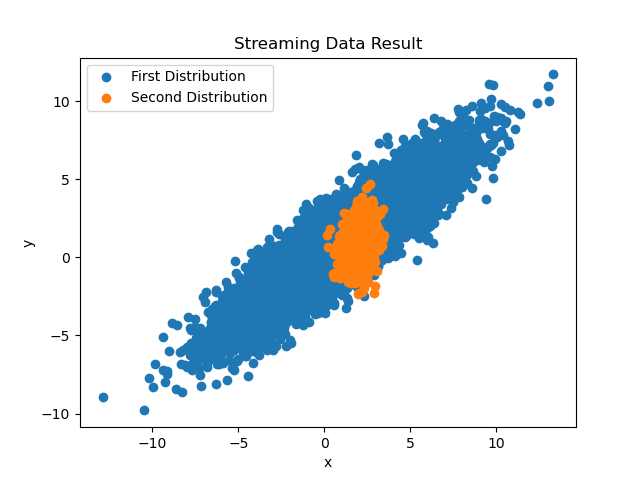
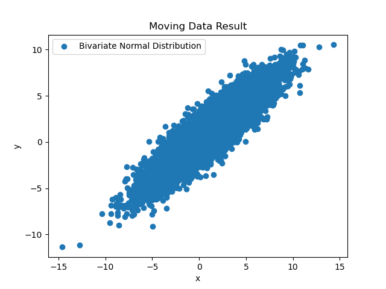

# Simple Human-in-The-Loop System for Modern Data Science Workflow
### An-Dan Nguyen (dan.nguyen@aalto.fi)
### (Aalto University)
## 1 Introduction
This repository contains the implementation of concepts of a simple and
versatile Human-in-The-Loop system to support modern Data Science workflow.
The concepts and the details of the scenario implemented in this repo are in
the paper manuscript "Simple Human-in-The-Loop System for Modern Data Science Workflow."

## 2 Concepts
The implemented concepts are mainly Interaction Point, Action Model, and Action Plan.
In short, Action Model governs how different workflow components interact with
each other at each Interaction Point. An Action Plan is a concrete Action Model
for a specific situation. Following programming technique concepts, Action Model
can be seen as a specific class, and Action Plan is a concrete object of that class.
The details are laid out in the manuscript.

In order to illustrate those concepts, an Action Model *if-this-then-that* (IFTTT),
which is named after the famous service [IFTTT (https://ifttt.com) is implemented
in this repository. The Action Model *if-this-then-that* is implemented in the
module [ifttt.py](./action_model/ifttt.py) under the folder [action_model](./action_model).

## 3 Demonstration Scenarios
Two scenarios are developed to demonstrate the Action Model *if-this-then-that*.
Those are streaming and moving data scenarios.
### 3.1 Streaming Data Scenario
In the streaming data scenario, the Action Plan *if-this-then-that* waits for
the accumulation of data from the stream is enough, then plots the accumulated data.

The Action Plan of the streaming data scenario is located in the folder
[action_plan](./action_plan) in the file [streaming_ifttt.json](./action_plan/streaming_ifttt.json).
The scripts to run this scenario is located in [scenario/ifttt/streaming](./scenario/ifttt/streaming).

The streaming data scenario can be demonstrated by running the scripts
(in the mentioned folder) in the following sequence:
- First, run the script [setup.py](./scenario/ifttt/streaming/setup.py) 
to set up the environment properly.
- Second, run the script [run_action_plan.py](./scenario/ifttt/streaming/run_action_plan.py)
to start the action plan.
- Third, run the script [run_scenario.py](./scenario/ifttt/streaming/run_scenario.py)
to start the scenario.

After finishing, a plot named [streaming.png](./result/streaming.png) is produced
under the folder [result](./result). The plot is a picture of two bivariate normal
distributions with different kernels. A sample plot is shown below.

### 3.2 Moving Data Scenario
In the moving data scenario, the Action Plan waits for the data to be moved from a
source folder to a destination folder, then plots the moved data.

The Action Plan of the moving data scenario is located in the folder
[action_plan](./action_plan) in the file [moving_ifttt.json](./action_plan/moving_ifttt.json).
The scripts to run this scenario is located in [scenario/ifttt/moving](./scenario/ifttt/moving).

The moving data scenario can be demonstrated by running the scripts
(in the mentioned folder) in the following sequence:
- First, run the script [data_generator.py](./scenario/ifttt/moving/data_generator.py)
to generate the data for moving.
- Second, run the script [setup.py](./scenario/ifttt/moving/setup.py)
to set up the environment properly.
- Third, run the script [run_action_plan.py](./scenario/ifttt/moving/run_action_plan.py)
to start the action plan.
- Fourth, run the script [run_scenario.py](./scenario/ifttt/moving/run_scenario.py)
to start the scenario.

After finishing, a plot named [moving.png](./result/moving.png) is produced under
the folder [result](./result). The plot is a picture of a bivariate normal distribution,
which is data that has just been moved. A sample plot is shown below.
